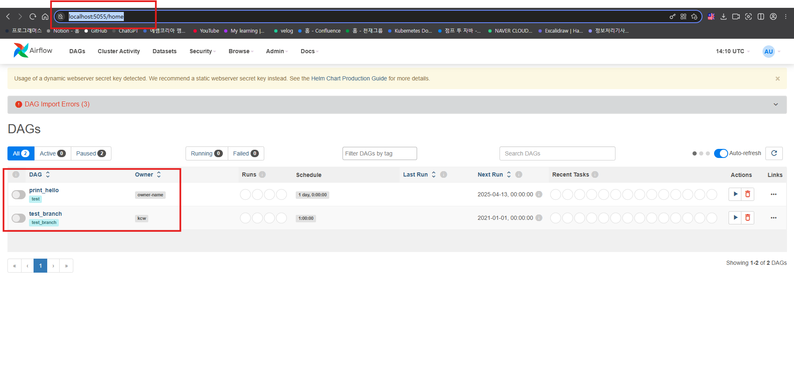

# Airflow-On-Kind
## 📦 About This Repository
* Quickly spin up Apache Airflow on your local Kind cluster using this ready-to-go Helm-based setup — perfect for development, testing, and experimenting with DAGs.

---

## ⚙️ Prerequisites

Make sure the following tools and environment are set up before running this project

### 🧰 Tools

| Tool      | Version Tested                                      |
|-----------|------------------------------------------------------|
| Docker    | `27.4.1`                                             |
| Kind      | `0.26.0`                                             |
| Helm      | `v3.15.2`                                            |
| kubectl   | **Client:** `v1.30.2` <br> **Server:** `v1.29.12` <br> **Kustomize:** `v5.0.4` |

### 🧱 Kind Node Image

- `kindest/node:v1.29.12`

You can verify your versions using:

```bash
docker --version
kind --version
helm version
kubectl version --output=yaml
```

### 🖥️ Environment

- Running on **WSL2**
- Linux distribution: **Ubuntu-20.04**

> ⚠️ This setup was tested in the environment above. Other versions may work, but are not officially verified.

---

## How to Deploy
### 1. Set Up Kind Cluster
Create a local Kubernetes cluster using Kind
```bash
kind create cluster --name ${cluster_name} --config ./kind-cluster.yaml
```

### 1-1. Verify Docker Containers
Ensure that your Kind nodes are running
```bash
docker ps -a
```
Example output:
```
CONTAINER ID   IMAGE                   COMMAND                  CREATED              STATUS              PORTS                                                                                                                                                  NAMES
06c4970b3ed3   kindest/node:v1.29.12   "/usr/local/bin/entr…"   About a minute ago   Up About a minute   0.0.0.0:5050->31000/tcp, 0.0.0.0:5051->31001/tcp, 0.0.0.0:5052->31002/tcp, 0.0.0.0:5053->31003/tcp, 0.0.0.0:5054->31004/tcp, 0.0.0.0:5055->31005/tcp   test-worker
0f8fa3aa1015   kindest/node:v1.29.12   "/usr/local/bin/entr…"   About a minute ago   Up About a minute   127.0.0.1:46309->6443/tcp                                                                                                                              test-control-plane
```

### 2. Create Namespace for Airflow
Set up a dedicated namespace for the Airflow deployment
```bash
kubectl create ns airflow
```

### 3. Deploy Storage Class, PVC, and PV for DAGs
This will mount a local directory into your cluster to store and manage DAG files:
```bash
kubectl apply -f local-pvc -n airflow
```
### 3-1 Config Git Sync (Optional)
If you want to use the dags folder from a Git repository, refer to the following manifest example.
```yaml
dags:
  gitSync:
    enabled: true

    # git repo clone url
    # ssh example: git@github.com:apache/airflow.git
    # https example: https://github.com/apache/airflow.git
    repo: <your git repo url>
    branch: main
    rev: HEAD
    # The git revision (branch, tag, or hash) to check out, v4 only
    ref: main
    depth: 1
    # the number of consecutive failures allowed before aborting
    maxFailures: 0
    # subpath within the repo where dags are located
    # should be "" if dags are at repo root
    subPath: ""
    # if your repo needs a user name password
    # you can load them to a k8s secret like the one below
    #   ---
    #   apiVersion: v1
    #   kind: Secret
    #   metadata:
    #     name: git-credentials
    #   data:
    #     # For git-sync v3
    #     GIT_SYNC_USERNAME: <base64_encoded_git_username>
    #     GIT_SYNC_PASSWORD: <base64_encoded_git_password>
    #     # For git-sync v4
    #     GITSYNC_USERNAME: <base64_encoded_git_username>
    #     GITSYNC_PASSWORD: <base64_encoded_git_password>
    # and specify the name of the secret below
    #
    credentialsSecret: git-credentials
```

### 4. Deploy the Airflow Helm Chart
Change Directory to manifest/airflow  Install the Airflow chart using your custom configuration file
```bash
cd manifest/airflow
helm install airflow -n airflow -f ./override-values.yaml . --debug
```

### 5. Access the Airflow Webserver & View DAGs
* Make sure to define a `hostPort` in `kind-cluster.yaml` to expose the Airflow Webserver.
* In your `override-values.yaml`, **`webserver.service.type` must be set to `NodePort`** in order to access the UI externally.

Example configuration
```yaml
webserver:
  service:
    type: NodePort
    annotations: {}
    ports:
      - name: airflow-ui
        port: "{{ .Values.ports.airflowUI }}"
        targetPort: 8080
        nodePort: 31005
```

WebServer <br>
``Once the webserver is up and running, you can access the Airflow UI and expect to see a screen similar to the one below.``



# Refernece
* https://velog.io/@sophi_e/Airflow-%EA%B8%B0%EC%B4%88-%EA%B0%9C%EB%85%90-%EB%B0%8F-%EC%9E%A5%EB%8B%A8%EC%A0%90
* https://lsjsj92.tistory.com/631
* https://lsjsj92.tistory.com/632
* https://velog.io/@hyunwoozz/airflow-%EB%B3%B5%EC%9E%A1%ED%95%9C-dag%EB%A5%BC-%EC%B6%94%EC%83%81%ED%99%94-%ED%95%98%EA%B8%B0
